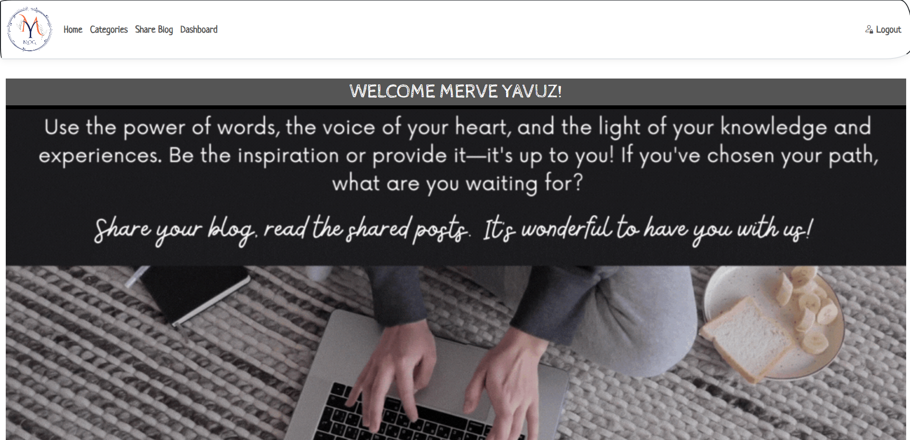

# MY BLOG APP 
## Technologies and Methods
* .NET 8 MVC
* Entity Framework - MSSQL
* Docker (Redis and MSSQL)
* Redis Cache (for user token, user like)
* Serilog (for user token, user like)
* Dependency Injection
* JWT Auth (for login)
* Cookie

## Project Description
A Web API service for a platform where users can share content on specific subjects. On this platform, users can create, share, and comment on content, as well as interact with other users. The admin user has the authority to delete and edit all of this content.

## Business Rules
* Users can register to the system.
* Users can log in.
* Users can share their photos or blogs through the system.
* Other users can like and comment on these shared contents.
* The admin can control all processes:
  - Add/edit/delete users.
  - Add/edit/delete content.
* Registered users can like blogs and share content.
* Users can list blogs by category.

## Note

📝 UI images associated with the application are located in the `\wwwroot\images\AppPhotos\` directory.

## Acknowledgements

🌟 I would like to express my gratitude to Atakan Göçer for his support in this project.
